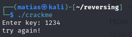
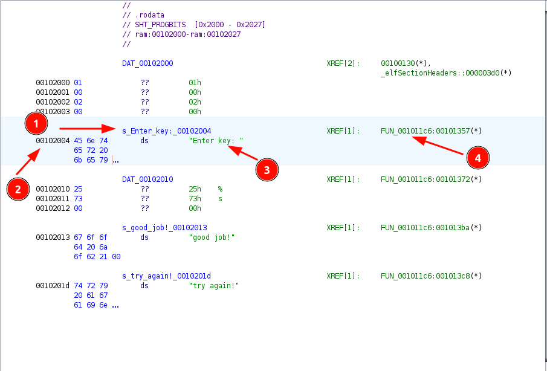
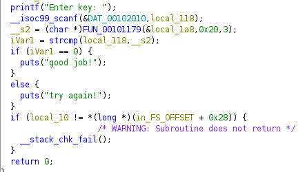
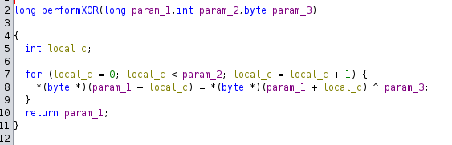
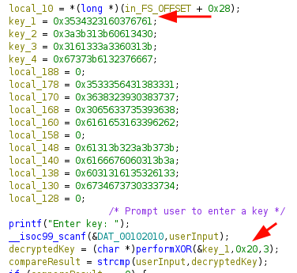
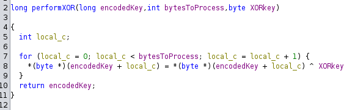
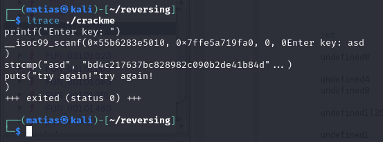

[kawaii-flesh's Simple crackme](https://crackmes.one/crackme/5d0d1e1333c5d41c6d56e155)

Extract:
```bash
unzip <file>
7z x <file>
chmod +x <file>
```

When you run it, asks for a key. If it's wrong, says try again and close:




I'll try to look for the string "Enter Key". So I'm going to look into the ".rodata" section. And see this: 



1. This is the **Label** that Ghidra has assigned to the memory location `0x001012004`. `s_` often indicates a string, but can vary
2. Address where the string starts
3. This is the string being stored "Enter key: "  and also the bytes representing it "45 6e 74..." in blue, at the left
4. This indicates there is one cross-reference (XREF) to "s_Enter_key:". This reference is from the function "FUN_001011c6" at address `0x00101357`

Let's go to that function, and we can see it's doing some validation on the input you provide. So let's rename the function to "chcekUserKey"
Also, at the bottom, we can see it's returning an int. So we can <u>Edit Function Signature</u> and set it as "int"

Let's rename some variables, so the code becomes clearer:



- local_118 seems to be **userInput**
- iVar1 seems to be **compareResult**

We can see a function "FUN_00101179(&local_1a8,0x20,3)". If we go to that function, we see:



It's performing a byte-wise XOR operation on a block of memory, and the "encodedKey" parameter will be 32 bytes (0x20) long, starting from the first key it's pointing:



The 3 parameters it takes are: 
- a pointer to the start of a memory block (param_1)
- the number of bytes to process (param_2)
- the XOR key (param_3)

This is the end result: 



By doing this on C (in Python didn't work), you should be able to concatenate all 4 keys, perform the XOR, and convert it back to text. 

Here's the answer: `bd4c217637bc828982c090b2de41b84d`. After crack from md5: `pass1785`

Also, if you run ltrace, can see directly against which string is comparing it:



---


