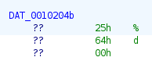

[nutcake's PieIsMyFav](https://crackmes.one/crackme/5c11e1f333c5d41e58e00579)

This is a good one to learn assembly.

We run it, and can get it in the first try, because it's called "PieIsMyFav".

I'm going to analyze it anyways. Let's see what ghidra shows, and look for "Qual o numero magico" string

It's a good thing we can check which format is expecting the scan to receive, by looking at `&DAT_0010204b`

Now we know it's a decimal.

We can see where is storing our input, and the local_14 variable seems to be holding our desired solution. 
Let's change the signature of the function to int, and rename some variables:

local_18 -> userInput
local_14 -> solution

The "solution" is achieved after doing some simple math:
(14 + 100 * 3) / 100 = 3.14
