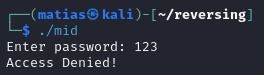
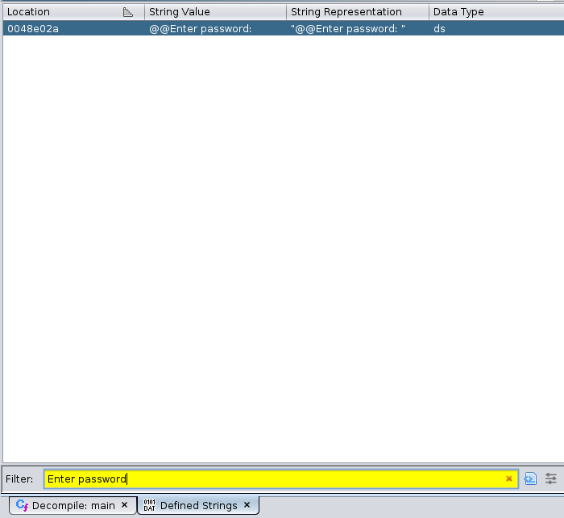
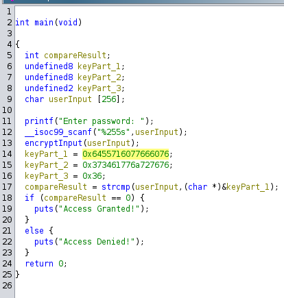
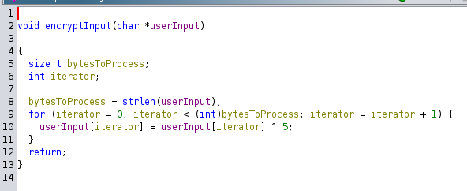

[jackioye's Simple but not simple](https://crackmes.one/crackme/6603c10ccddae72ae250bcd6)

This is very similar to the first one. Let's run the program

So, if we look for the string "Enter password" on the .rodata, we can get to the main function.
Another way of doing this, in some cases, is to look for the string directly in Window > Defined Strings

By clicking there, we'll get the string in the .rodata section, and from there can get the `main` function.

After modifying the signature, and renaming some variables, we get this as:

We see it's calling another function `encryptInput`

From this 2 functions, we know that our input is being xored with 5, and comparing it to the keyParts 1, 2 and 3. 
We already have the final value, and the XOR key. So, if we XOR the ardcoded values with 5, we can have what must be the input.

And, as we're dealing with little-endian, we need to read the hex value from the end to the beginning. 

For example, `0x6455716077666076` will be red as: `76 60 66 77 60 71 55 64`, and the same with the other keyPart

We can use the xor_decrypter in this same repo to decrypt the key. 
