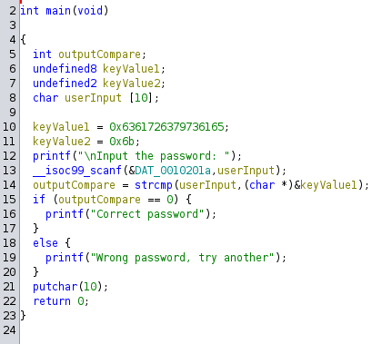
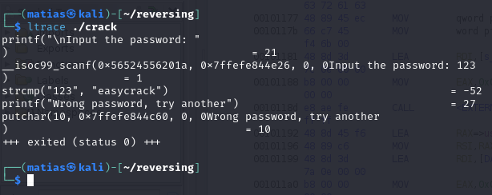

[nutcake's PrettyDamnEasy](https://crackmes.one/crackme/5c11dcaf33c5d41e58e00578)

This is an easy one. Run the program, look the output, and look for the string "password" in the .rodata section and you'll get the `main` function.

Here is the code with the variables renamed:

You can see it's comparing your input with the values in the "keyValue1" and "keyValue2" variables. 
Just by hovering with the mouse, you can see it's "easycrack".

Also can be solved using the `ltrace` tool:

