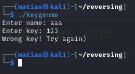
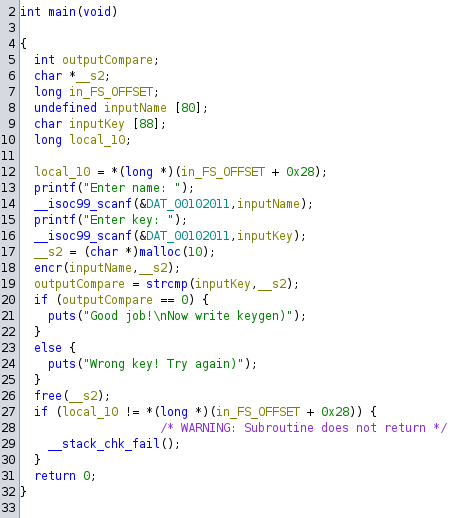
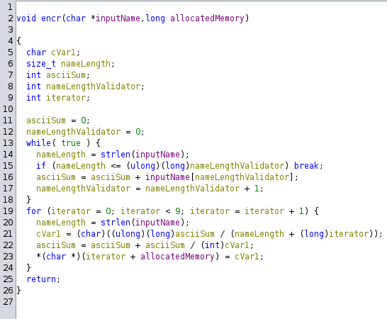

[kawaii-flesh Key and Keygen](https://crackmes.one/user/kawaii-flesh)

We run the program, and get:

Let's look for it on Ghidra, and go to the `main` function.

After I input both requested parameters (name & key), it's allocating 10 bytes of memory, and saving that pointer into the `__s2` variable (now "allocatedMemory"). 

Then it takes our inputName, and that value, and set it as parameters for the `encr` function. Let's see what's doing:

This is our encr function, with the variables already renamed. So, let's break down what this function is doing:
